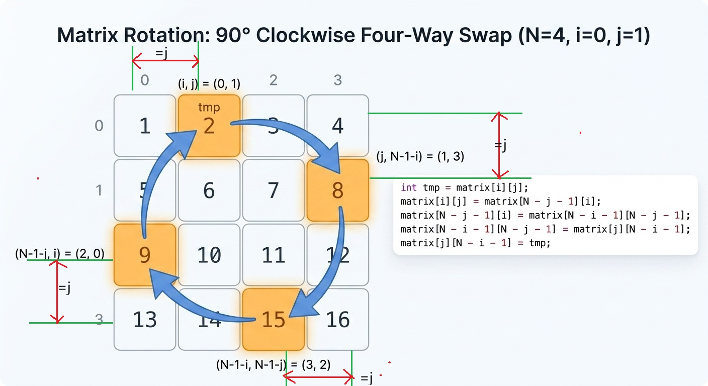

## 题目地址(48. 旋转图像)

https://leetcode-cn.com/problems/rotate-image/

## 题目描述

```
给定一个 n × n 的二维矩阵表示一个图像。

将图像顺时针旋转 90 度。

说明：

你必须在原地旋转图像，这意味着你需要直接修改输入的二维矩阵。请不要使用另一个矩阵来旋转图像。

示例 1:

给定 matrix =
[
  [1,2,3],
  [4,5,6],
  [7,8,9]
],

原地旋转输入矩阵，使其变为:
[
  [7,4,1],
  [8,5,2],
  [9,6,3]
]
示例 2:

给定 matrix =
[
  [ 5, 1, 9,11],
  [ 2, 4, 8,10],
  [13, 3, 6, 7],
  [15,14,12,16]
],

原地旋转输入矩阵，使其变为:
[
  [15,13, 2, 5],
  [14, 3, 4, 1],
  [12, 6, 8, 9],
  [16, 7,10,11]
]

```

## 前置知识

- 原地算法
- 矩阵

## 公司

- 阿里
- 腾讯
- 百度
- 字节

## 思路

这道题目让我们 in-place，也就说空间复杂度要求 O(1)，如果没有这个限制的话，很简单。

通过观察发现，我们只需要将第 i 行变成第 n - i - 1 列， 因此我们只需要保存一个原有矩阵，然后按照这个规律一个个更新即可。


代码：

```js
var rotate = function (matrix) {
  // 时间复杂度O(n^2) 空间复杂度O(n)
  const oMatrix = JSON.parse(JSON.stringify(matrix)); // clone
  const n = oMatrix.length;
  for (let i = 0; i < n; i++) {
    for (let j = 0; j < n; j++) {
      matrix[j][n - i - 1] = oMatrix[i][j];
    }
  }
};
```

如果要求空间复杂度是 O(1)的话，我们可以用一个 temp 记录即可，这个时候就不能逐个遍历了。
比如遍历到 1 的时候，我们把 1 存到 temp，然后更新 1 的值为 7。 1 被换到了 3 的位置，我们再将 3 存到 temp，依次类推。
但是这种解法写起来比较麻烦，这里我就不写了。

事实上有一个更加巧妙的做法，我们可以巧妙地利用对称轴旋转达到我们的目的，如图，我们先进行一次以对角线为轴的翻转，然后
再进行一次以水平轴心线为轴的翻转即可。


这种做法的时间复杂度是 O(n^2) ，空间复杂度是 O(1)

## 关键点解析

- 矩阵旋转操作

## 代码

- 语言支持: Javascript，Python3, CPP

```js
/*
 * @lc app=leetcode id=48 lang=javascript
 *
 * [48] Rotate Image
 */
/**
 * @param {number[][]} matrix
 * @return {void} Do not return anything, modify matrix in-place instead.
 */
var rotate = function (matrix) {
  // 时间复杂度O(n^2) 空间复杂度O(1)

  // 做法： 先沿着对角线翻转，然后沿着水平线翻转
  const n = matrix.length;
  function swap(arr, [i, j], [m, n]) {
    const temp = arr[i][j];
    arr[i][j] = arr[m][n];
    arr[m][n] = temp;
  }
  for (let i = 0; i < n - 1; i++) {
    for (let j = 0; j < n - i; j++) {
      swap(matrix, [i, j], [n - j - 1, n - i - 1]);
    }
  }

  for (let i = 0; i < n / 2; i++) {
    for (let j = 0; j < n; j++) {
      swap(matrix, [i, j], [n - i - 1, j]);
    }
  }
};
```

Python3 Code:

```Python
class Solution:
    def rotate(self, matrix: List[List[int]]) -> None:
        """
        Do not return anything, modify matrix in-place instead.
        先做矩阵转置（即沿着对角线翻转），然后每个列表翻转；
        """
        n = len(matrix)
        for i in range(n):
            for j in range(i, n):
                matrix[i][j], matrix[j][i] = matrix[j][i], matrix[i][j]
        for m in matrix:
            m.reverse()

    def rotate2(self, matrix: List[List[int]]) -> None:
        """
        Do not return anything, modify matrix in-place instead.
        通过内置函数zip，可以简单实现矩阵转置，下面的代码等于先整体翻转，后转置；
        不过这种写法的空间复杂度其实是O(n);
        """
        matrix[:] = map(list, zip(*matrix[::-1]))
```

CPP Code:

```cpp
class Solution {
public:
    void rotate(vector<vector<int>>& matrix) {
        int N = matrix.size();
        for (int i = 0; i < N / 2; ++i) {
            for (int j = i; j < N - i - 1; ++j) {
                int tmp = matrix[i][j];
                matrix[i][j] = matrix[N - j - 1][i];
                matrix[N - j - 1][i] = matrix[N - i - 1][N - j - 1];
                matrix[N - i - 1][N - j - 1] = matrix[j][N - i - 1];
                matrix[j][N - i - 1] = tmp;
            }
        }
    }
};
```

这段代码的核心思想是**“从外向内，分层旋转”**（类似于剥洋葱），并且在每一层中，通过**“四角循环交换”**，每次同时旋转 4 个对称位置的元素。

下面为您拆解这个算法最直观的逻辑。

---

### 第一步：理解“分层”与边界（双重循环）

假设我们有一个 $N \times N$ 的矩阵：

* **外层循环 `i` 控制“圈数”**：
  * `i = 0` 表示最外圈。
  * `i` 的范围是 `0` 到 `N / 2`。因为每次旋转会同时处理最外侧和最内侧，所以只需要处理到矩阵的一半高度即可（比如 4x4 的矩阵只需要处理 2 圈，5x5 的矩阵处理 2 圈，最中间的点不需要旋转）。
  
* **内层循环 `j` 控制当前圈的“边”**：
  * 在第 `i` 圈中，我们从左向右依次处理每一个元素。
  * `j` 的范围是 `i` 到 `N - i - 1`（**注意：不包含最后一个角上的元素**，因为最后一个角会被下一条边的旋转逻辑顺带处理，避免重复旋转）。

---

### 第二步：核心的“四角对称点”

对于当前圈（由 `i` 决定）的某一个位置 `j`，在矩阵中刚好有 **4 个对称的点**。如果要把矩阵顺时针旋转 90 度，这 4 个点刚好形成一个环，相互交换位置。

为了直观，我们把这 4 个点命名为：
* **$A$ (上边缘的某个点)**：`matrix[i][j]`
* **$B$ (右边缘的对应点)**：`matrix[j][N - i - 1]`
* **$C$ (下边缘的对应点)**：`matrix[N - i - 1][N - j - 1]`
* **$D$ (左边缘的对应点)**：`matrix[N - j - 1][i]`

#### 视觉直观图（以 $4 \times 4$ 矩阵，`i = 0`, `j = 1` 为例）：
此时 $N=4$。
* $A = (0, 1)$ —— 第一行，第二个
* $B = (1, 3)$ —— 第二行，最后一个
* $C = (3, 2)$ —— 最后一行，第三个
* $D = (2, 0)$ —— 第三行，第一个

```text
[ .   A   .   . ]
[ .   .   .   B ]
[ D   .   .   . ]
[ .   .   C   . ]
```

---

### 第三步：顺时针旋转的赋值顺序

顺时针旋转 90 度的移动方向是：
$$A \to B \to C \to D \to A$$

但是在写代码进行原地交换时，如果直接把 $A$ 赋给 $B$，那么 $B$ 原本的值就会丢失。因此，我们需要使用一个临时变量 `tmp` 先存下 $A$，然后**逆着移动方向进行赋值**（用后面的值覆盖前面的值）：

1. `int tmp = matrix[i][j];`  
   👉 **把 $A$ 存入临时变量**：`tmp = A`
2. `matrix[i][j] = matrix[N - j - 1][i];`  
   👉 **把 $D$ 移到 $A$**：`A = D`
3. `matrix[N - j - 1][i] = matrix[N - i - 1][N - j - 1];`  
   👉 **把 $C$ 移到 $D$**：`D = C`
4. `matrix[N - i - 1][N - j - 1] = matrix[j][N - i - 1];`  
   👉 **把 $B$ 移到 $C$**：`C = B`
5. `matrix[j][N - i - 1] = tmp;`  
   👉 **把刚才存的 $A$（即 `tmp`）移到 $B$**：`B = tmp`

这个过程可以用下图来直观表达：

```text
       A (tmp 先存起来)
     ↗   ↖
   B       D  (D 覆盖 A, C 覆盖 D)
     ↖   ↗
       C     (B 覆盖 C, 最后 tmp 覆盖 B)
```

当内层的 `j` 循环走完一轮，这一圈的所有元素就全部完成了 90 度的顺时针旋转；接着外层 `i` 增加，进入内圈，重复同样的操作，直到整个矩阵旋转完毕。

四个点坐标可根据 j 的长度来定位：


**复杂度分析**

- 时间复杂度：$O(M * N)$
- 空间复杂度：$O(1)$

大家对此有何看法，欢迎给我留言，我有时间都会一一查看回答。更多算法套路可以访问我的 LeetCode 题解仓库：https://github.com/azl397985856/leetcode 。 目前已经 37K star 啦。
大家也可以关注我的公众号《力扣加加》带你啃下算法这块硬骨头。

